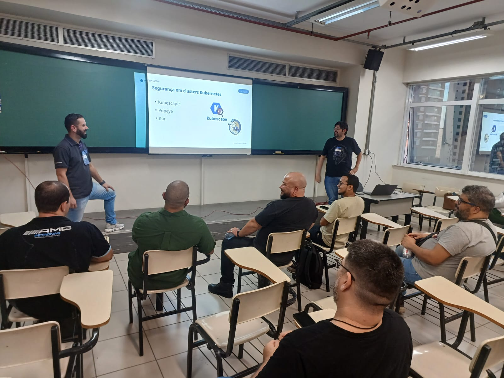

# seguranca-containers_mvpconf2025
Conteúdos da apresentação "Segurança em Containers: boas práticas, ferramentas, pontos de atenção...". 

Exemplos - clique nos links a seguir para acessar os repositórios correspondentes às demos:
- [**Workflow do GitHub Actions com execução do Docker Scout via CLI**](https://github.com/renatogroffe/GitHubActions-DockerScout-DotNet6)
- [**Pipeline do Azure DevOps com execução do Trivy para analisar vulnerabilidades de um cluster Kubernetes (criado com o emulador kind)**](https://github.com/renatogroffe/AzureDevOps-Trivy-kind)
- [**Workflow do GitHub Actions demonstrando o uso de Checkov, KICS, Kor e Gitleaks**](https://github.com/renatogroffe/workshop-seguranca-codigo_2025-10)
- [**Pipeline do Azure DevOps demonstrando o uso da ferramenta Popeye**](https://github.com/renatogroffe/AzureDevOps-Popeye-Kubernetes-kind)
- [**Pipeline do Azure DevOps demonstrando o uso do Kubescape**](https://github.com/renatogroffe/azuredevops-kubescape-kubernetes-kind)

---

## Informações sobre o evento

Título da apresentação: **Segurança em Containers: boas práticas, ferramentas, pontos de atenção...**

Data: **25/10/2025 (sábado)**

Tecnologias e tópicos abordados: **Containers, Docker, Kubernetes, Azure DevOps, GitHub Actions, Azure Kubernetes Service, Azure Container Apps, kind, Linux, .NET, ASP.NET Core, NuGet, npm, pip, Python, Docker Scout, Checkov, KICS, Kor, Gitleaks, Popeye, Kubescape, Trivy...**

Número de participantes: **16 pessoas**

O MVP Conf 2025 Brasil foi um evento presencial promovido pela comunidade de MVPs Microsoft no Brasil, tendo acontecido nos dias 24 e 25 de Outubro de 2025 em São Paulo-SP e contando com participantes de todo o Brasil.

Site do evento: **https://mvpconf.com.br | https://www.hubingressos.com.br/evento/mvpconf**

Local: **UNIP - Paraíso/Vergueiro - Rua Vergueiro, 1211 - Aclimação - São Paulo-SP - CEP: 01533-000**

Acesse este [**link**](/img/) para visualizar todas as fotos da apresentação.

Esta palestra foi realizada em conjunto com meu amigo **Diego Matos (Microsoft MVP)**.

Deixamos aqui nossos agradecimentos à organização do MVP Conf,  aos coordenadores da trilha de Segurança - **Daniel Donda**, **Eduardo Popovici**, **Rebecca Freire** - e participantes por todo o apoio em nossa palestra.

---

